# Lab2. Persistencia de objetos

> En estos ejercicios se muestran distintas alternativas para manejar la persistencia de los datos, en este caso, en un entorno relacional mediante dos alternativas:
> - Una inicial y más clásica como es __JDBC__
> - Una segunda y más orientada a JEE como es __JPA__
> 
> Requisitos: Disponer de una base de datos relacional instalada.

<!-- MarkdownTOC depth=3 -->

- [Ejercicio1.JDBC](#ejercicio1jdbc)
- [Ejercicio2. JPA](#ejercicio2-jpa)
    - [1. Convertir el proyecto a JPA](#1-convertir-el-proyecto-a-jpa)
    - [2. Crear el codigo JPA](#2-crear-el-codigo-jpa)
    - [3. Crear el DataSource](#3-crear-el-datasource)
    - [4. Iniciar la aplicacion](#4-iniciar-la-aplicacion)
- [Ejercicio3. Relaciones](#ejercicio3-relaciones)
- [ANEXO:](#anexo)
    - [Trabajo en Eclipse con JPA](#trabajo-en-eclipse-con-jpa)
    - [JPA Designer](#jpa-designer)
    - [Referencias](#referencias)

<!-- /MarkdownTOC -->


## Ejercicio1.JDBC

> Esto es un ejemplo más que un ejercicio para demostrar el uso de JDBC y su posterior comparación con JPA.
> 
> Observa el código de las soluciones para entender las explicaciones.

1. Modificamos el dominio __Usuario__ para añadirle un campo nuevo `int id` que servirá para identificar la clave primaria
2. Creamos una nueva estructura de paquetes:

```
es.uc3m.tiw
        ../lab2
            ../daos
            ../servlets
```

3. En el paquete DAOs, incorporamos:
    4.  Un _interfaz_ llamado __UsuarioDAO__ que definirá las operaciones 
    5.  y una clase que implementa dicho interfaz que se llamará __UsuarioDAOImpl__ que contendrá las operaciones reales contra la base de datos.

> Si observas el código, este tiene los métodos básicos de un CRUD<sup id="a1">[1](#f1)</sup> (altas, bajas y modificaciones), más un par de métodos para manejar las conexiones.
>
> La clase __UsuarioDAOImpl__ tiene el código JDBC para insertar y recuperar datos de la base de datos (_Statement, PreparedStatement, ResultSet y Connection_)

4. Creamos una clase nueva llamada __Conector__ y un fichero de texto plano: __persistencia.properties__

> La clase Conector gestiona las conexiones con varias bases de datos y utiliza un patrón Singleton<sup id="a2">[2](#f2)</sup> para devolver una sola instancia. Para flexibilizar las conexiones con varias bases de datos de manera local o en remoto con un DataSource,<sup id="a3">[3](#f3)</sup> esta clase hace uso de un fichero .properties
> 
> El fichero _persistencia.properties_ es invocado tanto por el Conector como por el DAO, lo que permite modificar valores de bases de datos, drivers, conexiones y sentencias sin tener que recompilar las clases, y se carga mediante el objeto ResourceBundle<sup id="a4">[4](#f4)</sup>
> 

5. El __LoginServlet__ debe cambiar ahora su código eliminando la creación de la lista de usuarios en memoria y usar el DAO para sacar los usuarios directamente de la base de datos.
    6. Para ello hace uso de la clase conector y pasa la conexión y el objeto ResourceBundle al DAO.
    7. En el ejemplo el servlet recupera la conexión de un DataSource remoto, por lo que previamente habría que crearlo en el servidor.

> Ya sólo nos queda crear la tabla __USUARIOS__ en el esquema de base de datos __tiw__ con las columnas emparejadas a las propiedades de la clase __Usuario__ para que todo funcione adecuadamente.
> 

6. Para finalizar, se propone la creación de la infraestructura necesaria para insertar  y modificar usuarios en dicha tabla, mediante unos formularios web. Para ello se necesitará:
    7. Un nuevo Servlet: __UsuarioServlet__
    8. Dos nuevas páginas: __altausuario.jsp__ y __editarusuario.jsp__

> Ambas páginas envían los datos al mismo servlet y un campo oculto con un mensaje que informa al servlet sobre qué acción debe hacer: insertar o actualizar.
> 
> En las soluciones aportadas encontrarás que el código no es completamente funcional y está sin terminar, pero puedes hacerte una buena idea y si quieres puedes completarlo.
> 

> Este escenario es un __MVC__ completo, donde los controladores (Servlets) reciben acciones, ejecutan lógica de negocio y redirigen a las nuevas vistas o trasladan las acciones a la capa de persistencia, las vistas se mantienen separadas de la base de datos y obtienen la información de los controladores.


## Ejercicio2. JPA

> En esta ocasión vamos a refactorizar el proyecto para insertar JPA.
> Algunas desventajas de JDBC son:
> 
> - Workflow de trabajo demasiado rígido
> - Propenso a fallos (sentencias como strings, try-catch)
> - Mezcla de tecnologías (OO y SQL)
> - Mucha infraestructura/complejidad para sentencias simples
> - Necesario usar recursos externos a JDBC para mejorar el trabajo, (patrones, ResourceBundles)
> - Difícil realizar un mapping Objeto-Relacional
> - Baja escalabilidad
> 
> Por todo esto, en los proyectos se prefiere el uso de un framework ORM.

>__NOTA:__ En muchos proyectos se usa una infraestructura basada en módulos, declarando un módulo reutilizable para la persistencia, lo que necesitaría crear un nuevo proyecto de tipo utilidad y realizar las configuraciones necesarias para que el proyecto web incorpore al proyecto persistencia como librería.
En esta ocasión y por simplicidad se propone incorporar toda la persistencia dentro del propio proyecto laboratorios como un paquete más, siendo lo más indicado lo comentado anteriormente.

### 1. Convertir el proyecto a JPA

> Para ayudarnos al desarrollo con JPA vamos a usar las herramientas de eclipse que nos facilitarán el desarrollo.

1. click derecho sobre el proyecto laboratorios y elige: __Configure->convert to JPA project...__
2. En el diálogo que aparece asegúrate de que Glassfish está seleccionado como Runtime
3. 
4. Pulsa __Next__ y pon los valores como aparecen en la siguiente pantalla:
5. 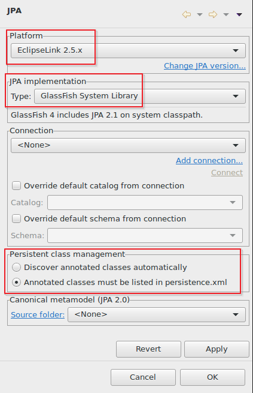
6. Pulsa __Finish__ y se habrá generado un nuevo descriptor __persistence.xml__ dentro de un directorio __META-INF__ ábrelo con doble clic.
7. 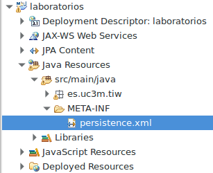
8. En la ventana que aparece cambia estos valores:
    9. __Name:__ laboratoriosPU
    10. __Persistence Provider:__ org.eclipse.persistence.jpa.PersistenceProvider
    11. __Managed classes:__ agrega el dominio usuario
12. 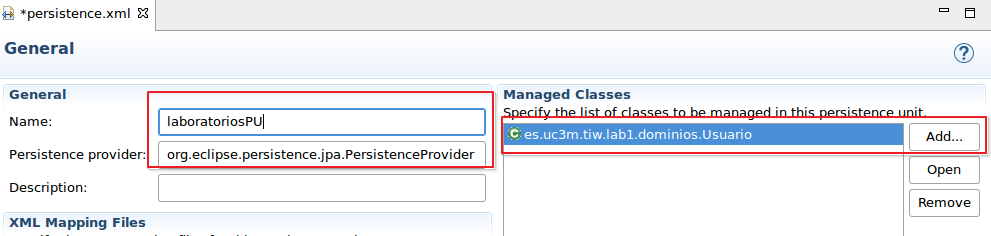
13. En la parte inferior del editor cambia a la __pestaña Connection__ y aplica los siguiente valores:
14. 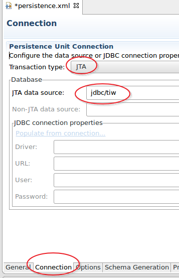
15. Cambia a la __pestaña Options__ y modifica el valor _Loggin level_ a __Fine__
16. 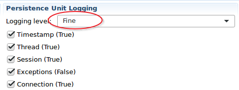
17. En la __pestaña Schema Generation__ modifica el valor a __Create__
18. 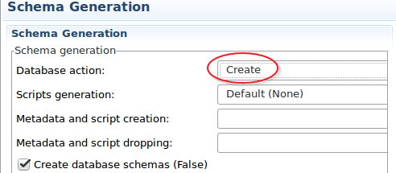
19. En la __pestaña Properties__ añade una nueva propiedad como la siguiente:
20. 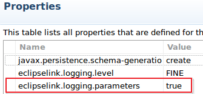
21. Guarda los cambios

Deberías tener un código como el siguiente (pulsando sobre la _pestaña source_):

```xml
<?xml version="1.0" encoding="UTF-8"?>
<persistence version="2.1"
    xmlns="http://xmlns.jcp.org/xml/ns/persistence" xmlns:xsi="http://www.w3.org/2001/XMLSchema-instance"
    xsi:schemaLocation="http://xmlns.jcp.org/xml/ns/persistence http://xmlns.jcp.org/xml/ns/persistence/persistence_2_1.xsd">
    <persistence-unit name="laboratoriosPU"
        transaction-type="JTA">
        <provider>org.eclipse.persistence.jpa.PersistenceProvider</provider>
        <jta-data-source>jdbc/tiw</jta-data-source>
        <class>es.uc3m.tiw.lab1.dominios.Usuario</class>
        <properties>
            <property name="javax.persistence.schema-generation.database.action"
                value="create" />
            <property name="eclipselink.logging.level" value="FINE" />
            <property name="eclipselink.logging.parameters" value="true" />

        </properties>
    </persistence-unit>
</persistence>
```

### 2. Crear el codigo JPA

1. Modifica la clase `es.uc3m.tiw.lab1.dominios.Usuario` para que su código sea JPA
2. Sustituye el código JDBC de la clase `es.uc3m.tiw.lab2.dominios.UsuarioDAOImpl` por código JPA para manejar la persistencia mediante un objeto __EntityManager__
3. Modifica los servlet `es.uc3m.tiw.lab1.LoginServlet` y `es.uc3m.tiw.lab1.UsuarioServlet` para que usen ahora código JPA. Puedes obtener la unidad de persistencia de dos maneras:
    - Por código: 
    ```java
    EntityManager em = Persistence.createEntityManagerFactory("laboratoriosPU").createEntityManager();`
    ```
    - Por anotaciones: 
```java
    @PersistenceContext(unitName="laboratoriosPU")
    private Entitymanager em;
```

### 3. Crear el DataSource

> En el fichero _persistence.xml_ hemos usado la cadena `jdbc/tiw` como definición del DataSource de Glassfish que apunta a nuestra base de datos. Antes de continuar es necesario crear dicho recurso en el servidor Glassfish.

1. Abre la consola de administración de Glassfish: [https://localhost:4848](https://localhost:4848). Usuario/password: admin/admin
2. Crea el DataSource.
    3. Puedes usar la guía de referencia del material de clase.

### 4. Iniciar la aplicacion

1. Despliega la aplicación en el servidor Glassfish
2. Observa en MySql como se ha creado una nueva tabla gracias a la estrategia `create`
3. 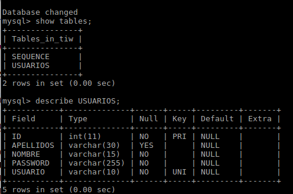
3. El resto de la aplicación debería ser funcional y permitir crear nuevos usuarios, actualizarlos y borrarlos.
    4. __NOTA:__ `create` creará las tablas si no existen y a continuación el servlet insertará los registros de usuarios de prueba, si piensas hacer pruebas y lanzar varias veces la aplicación, te devolverá una excepción porque los registros ya existen, para este caso es mejor usar `drop-and-create`.

## Ejercicio3. Relaciones

> En este ejercicio se propone la creación de relaciones 1-1 entre entidades.

1. Crea un nuevo dominio `es.uc3m.tiw.lab2.dominios.Direccion` con las siguientes propiedades:
    2. `String calle;`
    3. `int codigoPostal;`
    4. `String ciudad;`
    5. `String pais;`
6. Establece la relación `OneToOne` entre Usuario y Direccion.
7. Modifica el formulario de edición para que al editar un usuario se pueda agregar su dirección asociada.
8. Crea un nuevo DireccionDAO y DireccionDAOImpl para manejar la persistencia de las direcciones
9. Agrega la nueva lógica para manejar direcciones en los servlets
10. Comprueba como se ha creado la nueva tabla `DIRECCIONES` junto a la `FOREIGN_KEY` en la tabla `USUARIOS`
11. Edita un usuario en el formulario y comprueba como se almacenan los resultados en las tablas.
12. 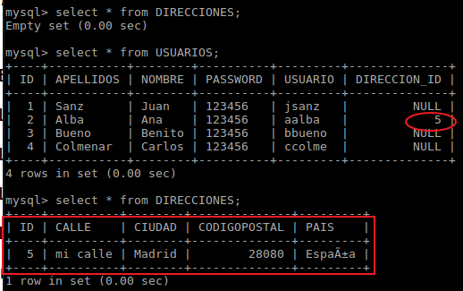

> __Trabajo recomendado:__ Modifica el proyecto para incluir relaciones `OneToMany` y `ManyToMany`. Por ejemplo un usuario puede tener varias direcciones asociadas y una dirección puede ser compartida por varios usuarios.
> 
> JPA incluye muchas características potentes para el trabajo con datos, revisa la documentación sobre _Relaciones_, _Herencia_, _Fetch_, _personalización de las relaciones y tablas con JoinTable y JoinColumn_. 
> 


## ANEXO: 

### Trabajo en Eclipse con JPA

Desde la __perspectiva JPA__ en eclipse es posible trabajar más cómodamente sin necesidad de recordar todas las opciones disponibles en JPA. Para ello simplemente cambia de perspectiva a JPA

Haz clic en el nombre de la clase o en el nombre de alguna propiedad y verás como cambia el cuadro inferior __"JPA Details"__, este permitirá configurar la entidad con valores como el nombre de la tabla, el esquema, la estrategia de generación de clave primaria, las constraints, o el tipo fetch entre otros.
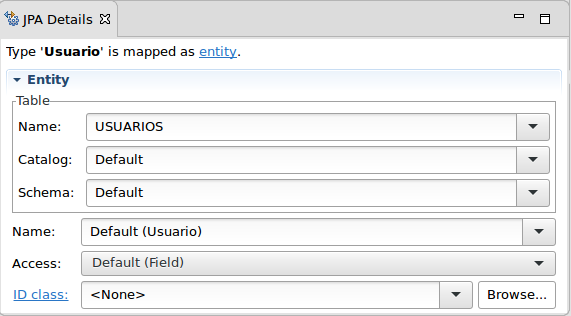 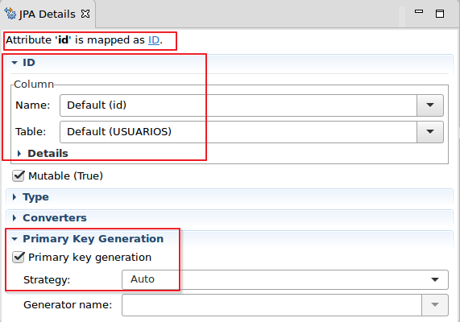 .

> __NOTA:__ Para que esto funcione adecuadamente es necesario:
> 1. Anotar inicialmente la clase como `@Entity` 
> 2. Salvar los cambios cada vez que se modifique algo, si no el cuadro _JPA Details_ no se actualiza.

JPA necesita que las entidades se encuentren escritas en el fichero `persistence.xml` y eclipse proporciona un atajo para realizar este trabajo:
1. Selecciona la entidad con el botón derecho del ratón
2. Elige: __JPA Tools->ADD to Persistence Unit__


### JPA Designer

> A veces resulta útil disponer de un entorno gráfico para manejar las entidades y ver las relaciones con otras entidades.

Eclipse proporciona una herramienta gráfica para manejar las entidades, pero no viene instalada por defecto.

1. Menu __Help -> Install new software__
2. En la pantalla que aparece despliega en el primer campo y elige la URL asociada a _Neon_
3. __Cuando termine la búsqueda__ y aparezcan resultados, en el campo filtro escribe: _jpa_
4. Marca la opción __JPA Diagram Editor__ acepta y continua con la instalación.
5. 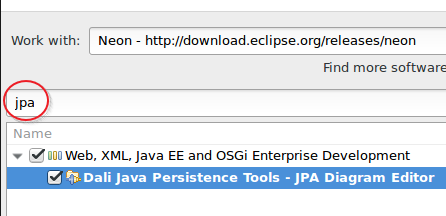 
5. Se te pedirá que reinicies eclipse: Acepta con YES.
6. Tras reiniciar, selecciona el proyecto _laboratorios_ con el botón derecho y __JPA Tools->Open Diagram__
    7. Desde el diagrama creado podrás crear entidades y relaciones.
8. Si ya tienes entidades creadas puedes arrastrarlas sobre el diagrama.
9. 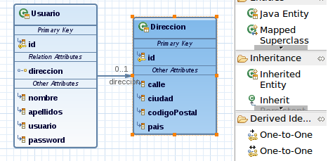

> __ATENCION:__ No borres directamente una entidad del diagrama pues borrará también el código original (opción cubo de basura o delete), si lo que quieres es simplemente eliminarla del diagrama selecciona la entidad y (selecciona el icono del diskette junto al cubo de basura, opción: save and remove from diagram) 

---

### Referencias

- <b id="f1">1</b>: [CRUD](https://es.wikipedia.org/wiki/CRUD)[↩](#a1)
- <b id="f2">2</b>: [Singleton](https://es.wikipedia.org/wiki/Singleton)[↩](#a2)
- <b id="f3">3</b>: [DataSource](https://en.wikipedia.org/wiki/Datasource)[↩](#a3)
- <b id="f4">4</b>: [ResourceBundle](https://docs.oracle.com/javase/7/docs/api/java/util/ResourceBundle.html)[↩](#a4)