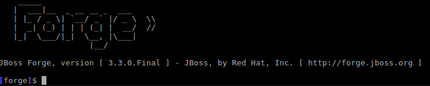
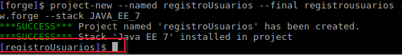
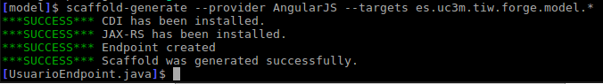
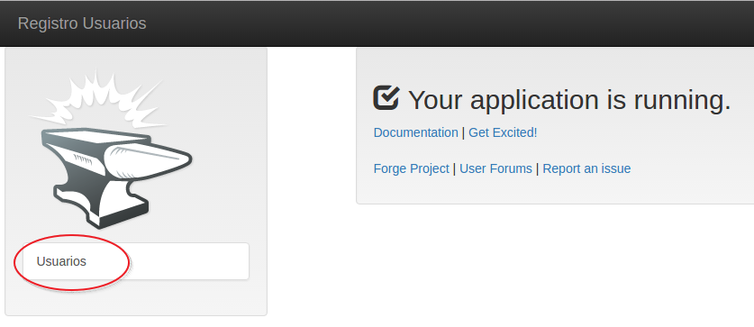
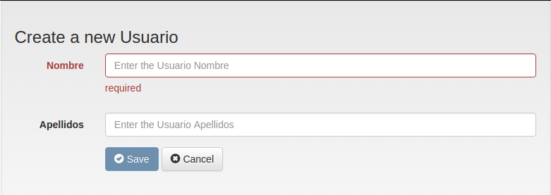
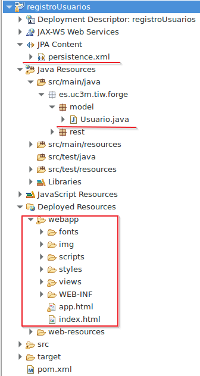

# Lab5. JBoss Forge

> JBoss Forge permite acelerar la construcción de proyectos JEE y aunque hay plugins gráficos para varios entornos, en esta ocasión usaremos la versión de consola de comandos por rapidez.
> 
> Una vez adquiridos los conocimientos necesarios para trabajar con componentes JEE podemos ayudarnos de herramientas que aceleran nuestro trabajo como JBoss Forge <sup id="a1">[1](#f1)</sup>
> 

<!-- MarkdownTOC -->

- [Creacion del proyecto](#creacion-del-proyecto)
- [Configurando la persistencia](#configurando-la-persistencia)
- [Generación de las vistas. Scaffolding](#generación-de-las-vistas-scaffolding)
- [Despliegue en el servidor](#despliegue-en-el-servidor)
- [Usando Eclipse](#usando-eclipse)
- [Observa](#observa)
- [Referencias](#referencias)

<!-- /MarkdownTOC -->


## Creacion del proyecto

1. Abre una terminal de comandos _( <kbd>CTRL + ALT + T</kbd> si usas la imagen   )_ y crea un nuevo directorio:
    2. `mkdir forgelab`
    3. `cd forgelab`
3. escribe el comando `forge` por pantalla y espera a que aparezca la consola de JBoss Forge.
4. 
5. Escribe el siguiente comando (puedes usar la tecla <kbd>TAB</kbd> como ayuda e irán apareciendo comandos y parámetros):

```
 project-new --named registroUsuarios --final registrousuarios --version 1.0 --top-level-package es.uc3m.tiw.forge --stack JAVA_EE_7
```

6. Cuando termine aparecerá un mensaje de éxito y el prompt se situará en el proyecto:
7. 


## Configurando la persistencia

1. Escribe el siguiente comando (apóyate en <kbd>TAB</kbd>):

```
jpa-setup --jpa-provider Eclipse\ Link --db-type MYSQL_INNODB --data-source-name jdbc/tiw --persistence-unit-name forgelabPU 
```

2. A continuación:

```
jpa-new-entity --named Usuario --idStrategy AUTO
```

3. Observa que ahora el prompt se ha situado en la clase Usuario.java. 
4. Escribe el siguiente comando para añadir una propiedad `String nombre` con métodos get/set

```
[Usuario.java]$ jpa-new-field --named nombre --type String --length 20 --not-nullable 
```

5. Crea otra propiedad `String apellidos`

```
[Usuario.java]$ jpa-new-field --named apellidos --type String

```

## Generación de las vistas. Scaffolding

6. Escribe el comando `cd ..` para subir al paquete `model` y a continuación escribe el siguiente para generar las vistas:
    7. Puedes elegir entre __Faces o AngularJS__

```
[model]$ scaffold-generate --provider AngularJS --targets es.uc3m.tiw.forge.model.*  
```
8. 
9. Cuando finalice escribe `build` presiona <kbd>ENTER</kbd> y espera hasta que salga el mensaje: `***SUCCESS*** Build Success`

> __Build__ generará un fichero _registrousuario.war_ en el directorio _target_ que puedes usar para desplegar desde la consola de Glassfish/Payara.
> 

## Despliegue en el servidor

1. Abre la consola de administración de Glassfish/Payara Server ([https://localhost:4848](https://localhost:4848))
2. En el menú lateral selecciona __Applications__
3. Pulsa el botón __Deploy__
4. Botón __Choose File__ y selecciona el fichero registrousuarios.war _(./forgelab/registroUsuarios/target/registrousuarios.war)_
    5. __NOTA:__ Posiblemente el servidor de un `warning` debido a que la tabla `SEQUENCE` ya estaba creada por otro proyecto.
5. Navega a la dirección [http://localhost:8080/registroUsuarios](http://localhost:8080/registroUsuarios) y verás la aplicación generada:
6. 
7. 
8. 

> La aplicación está configurada para aplicar validación en función de los campos y contiene un buscador de usuarios. 
> Prueba a crear algunos usuarios y comprobar en MySQL como se ha creado una tabla `USUARIO` que contiene los usuarios creados.

## Usando Eclipse

1. Elimina la aplicación del servidor Glassfish/Payara
    2. __Consola de administración->Applications->Marca "registroUsuarios"->Botón undeploy__
3. En eclipse:
    4. __File->Import->Maven->Existing Maven projects__
    5. .../forgelabs/registrousuarios
    6. Acepta
7. Si tienes activada la consola de maven verás como se descargan todas las dependencias para configurar el proyecto.
8. Al finalizar dispondrás de un proyecto JEE muy similar al que hemos estado construyendo
9. 

## Observa

>
> Puedes comprobar como se ha generado el código y la estructura. Los dominios van en un paquete `model` los ejbs en `service`.
> 
> Mira también el fichero `persistence.xml` no será muy diferente del que hemos creado.
> 
> Puedes probar a crear también un ejb, para ello escribe en el terminal `ejb-setup` y a continuación `ejb-new-bean` si pulsas <kbd>TAB</kbd> te dará opciones y si eliges `--type` y vuelves a pulsar <kbd>TAB</kbd> te dirá los tipos de EJBs que puedes usar (algo que ya debería ser familiar).
> 

         [registroUsuarios]$ ejb-new-bean --type
            MESSAGEDRIVEN  SINGLETON  STATEFUL  STATELESS

Prueb otras opciones, como hacer relaciones entre entidades, usar servicios, crear servlets, usar JSF, etc. Puedes encontrar muchos ejemplos en la documentación oficial <sup id="a2">[2](#f2)</sup>

---
## Referencias

<b id="f1">1</b>: [JBoss Forge](https://forge.jboss.org) [↩](#a1)
<b id="f2">2</b>: [https://forge.jboss.org/documentation](https://forge.jboss.org/documentation) [↩](#a2)