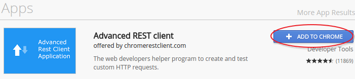
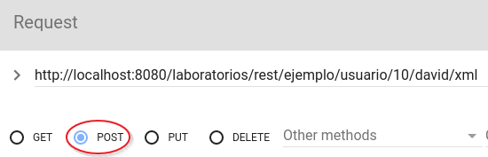
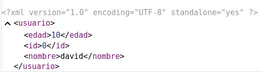
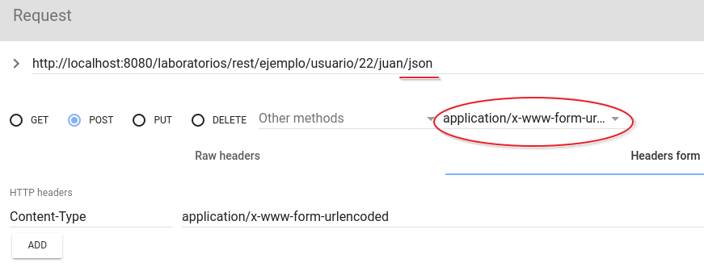
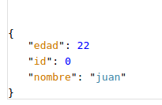

# Lab6. Servicios RESTful

<!-- MarkdownTOC -->

- [REST Software](#rest-software)
- [Ejercicio1. Configuración](#ejercicio1-configuración)
- [Ejercicio2. Creacion del servicio](#ejercicio2-creacion-del-servicio)
- [Ejercicio3. Paso de parámetros](#ejercicio3-paso-de-parámetros)
- [Ejercicio4. POST y documentos](#ejercicio4-post-y-documentos)
- [Ejercicio5. JSON](#ejercicio5-json)
- [Forge](#forge)

<!-- /MarkdownTOC -->

## REST Software

>Necesitas un software que permita usar métodos de conexión distintos a GET y POST, por lo que puedes usar el software autónomo __REStClient__ de [http://www.wiztools.org]() o bien instalar un plugin para Chromium llamado __Advanced REST Client__

1. Abre Chromium  y accede a la webstore [https://chrome.google.com/webstore/category/extensions?hl=en-US]()
2. Busca la extensión __Advanced REST Client__ e instálala.
3. 

## Ejercicio1. Configuración

> En este ejercicio vamos a crear la inftaestructura REST usando la librería __jersey__ que ya está instalada en las dependencias del proyecto.
> 
> - Es necesario primero crear una clase de configuración que establezca el path de consulta para devolver documentos con peticiones GET, POST, PUT y DELETE.
> - la Url según esta configuración será `http://localhost:8080/laboratorios/rest/`

1. Crea una nueva estructura de paquetes:

```
    es.uc3m.tiw.lab6
                  ../config
                  ../rest
```

2. Crea una nueva clase `es.uc3m.tiw.lab6.config.ApplicationConfig` que herede de `import javax.ws.rs.core.Application`
3. El código que debe contener es el siguiente:

```java
@ApplicationPath("rest")
public class ApplicationConfig extends Application {

    public Set<Class<?>> getClasses() {
        return getRestClasses();
    }
    
    //Auto-generated from RESTful web service wizard
    private Set<Class<?>> getRestClasses() {
        Set<Class<?>> resources = new java.util.HashSet<Class<?>>();
        
        resources.add(es.uc3m.tiw.lab6.rest.EjemploService.class);
        return resources;    
    }
}
```

## Ejercicio2. Creacion del servicio

> En la clase de configuración anterior le pasamos la clase `EjemploService.class`, en este ejercicio vamos a crearla.
> 
> Esta clase definirá el acceso al servicio estableciendo las URLs.
> 
> - La URL será: `http://localhost:8080/laboratorios/rest/ejemplo/prueba/...`
> 

1. Crea una nueva clase `es.uc3m.tiw.lab6.rest.EjemploService`
2. Incopora la anotación _path_ con la ruta _ejemplo_
    3. `@Path("ejemplo")`
4. Crea un método `getText()` que devuelva un `String` que solamente se pueda acceder por `GET` que el contenido que devuelva sea `Texto plano` y que la ruta de acceso sea `/prueba`. El código debería parecerse al siguiente:

```java
@GET
        @Path("prueba")
        @Produces(MediaType.TEXT_PLAIN)
        public String getText() {
            return "Todo OK";
        }
```
5. Lanza el navegador a la URL: [http://localhost:8080/laboratorios/rest/ejemplo/prueba]() y la respuesta obtenida debería ser: __Todo Ok__

## Ejercicio3. Paso de parámetros

> en este ejercicio hay que hacer uso de las anotaciones `@PathParam` y `@QueryParam` para permitir el paso de parámetros mediante la URL.

1. Crea un nuevo método que admita dos parámetros por URI y devuelva un mensaje con dichos parámetros en texto plano. La URL de acceso será: [http://localhost:8080/laboratorios/rest/ejemplo/prueba/10/hola]()
2. Crea otro método que admita dos parámetros pero de una forma más clásica mediante `QUERY_STRING` y devuelva un mensaje en texto plano con dichos parámetros. La URL será: [http://localhost:8080/laboratorios/rest/ejemplo/prueba/query?numero=10&palabra=hola]()

## Ejercicio4. POST y documentos

> En este ejercicio vamos a probar a usar otros métodos de conexión distintos del `GET`, en concreto `POST`. 
> El ejercicio consistirá en escribir un método que admita 2 parámetros mediante POST, lo reciba y cree un objeto `Usuario` con dichos parámetros y deluelva el objeto Usuario como documento `XML`.
> 
> La URL será del tipo: [http://localhost:8080/laboratorios/rest/ejemplo/usuario/10/david/xml]()
> 
> Observa que la URL termina con /xml por lo que los parámetros pueden ir en cualquier parte de la URL.

1. Crea un nuevo método que tenga lo siguiente:
    2. admita POST como método de conexión 
    3. reciba 2 parámetros (__String nombre__ y __int edad__) por URL mediante `@PathParam`  
    4. Cree un nuevo Usuario con esos parámetros
    5. Devuelva el usuario creado.
    6. Acepte `texto plano` como entrada
    7. Devuelva `xml` como salida
6.  Modifica la clase `Usuario` para añadirle la edad.
7.  Anota la clase `Usuario` con la anotación `@XmlRootElement` para que sea convertida explícitamente en xml al devolverla el servicio.
8.  Abre la extensión __Advanced Rest Client__
    9.  Invoca la dirección de acceso estableciendo el método como `POST`
    10.  
11.  Cuando pulses sobre el botón <kbd>SEND</kbd> obtendrás una respuesta en formato XML
    12.  

## Ejercicio5. JSON

> En este ejercicio se propone devolver un documento JSON del `Usuario` con los mismos valores (edad y nombre) pero esta vez pasados por un formulario.
> 

1. Crea un nuevo método que contenga:
    2. admita `POST` como método de conexión
    3. Consuma `APPLICATION_FORM_URLENCODED`
    4. Devuelva `APPLICATION_JSON`
5. Abre la extensión __Advanced REST Client__
6. Configúrala para que envíe los datos codificados como un formulario
    7. 
8. Obtendrás una respuesta como esta:
    9. 

## Forge

> JBoss Forge dispone de comandos para configurar y generar servicios REST automáticamente y de manera simple.
> 
>  __Propuesta:__
>  - Observa el código creado en el proyecto _registroUsuarios_ y verás código REST
>  - Investiga los comandos necesarios para crear un nuevo servicio REST.


