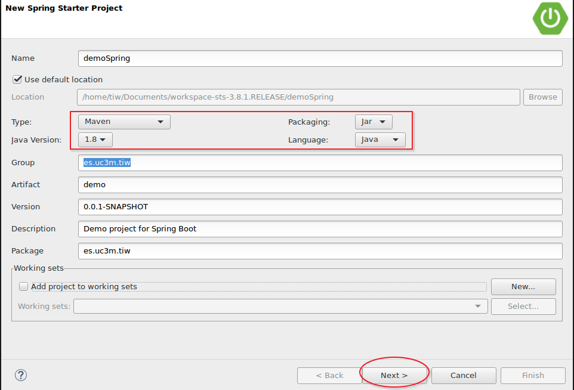
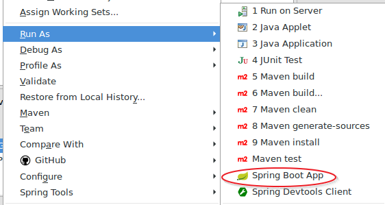
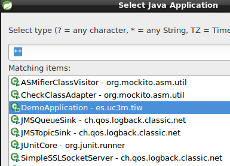

# Lab7. SpringBoot

> SpringBoot <sup id="a1">[1](#f1)</sup> es una herramienta de la familia SpringFramework <sup id="a2">[2](#f2)</sup> que acelera el desarrollo reduciendo la complejidad de las configuraciones, así como la cantidad de código necesario para enlazar todos los módulos necesarios para el desarrollo de una aplicación.
> 
> SpringBoot ha sido diseñada para concebir las aplicaciones de manera monolítica o como microservicios, haciendo muy fácil el desarrollo de servicios REST.
> 
> En este laboratorio iremos construyendo una aplicación "estilo spring" usando los módulos para el desarrollo de una aplicación web/REST completa junto a la persistencia con JPA. Para ello haremos uso de los siguientes módulos:
> 
> - SpringMVC <sup id="a3">[3](#f3)</sup>
> - SpringData <sup id="a4">[4](#f4)</sup>
> - SpringREST <sup id="a5">[5](#f5)</sup>
> - SpringHATEOAS <sup id="a6">[6](#f6)</sup>

## INDICE

<!-- MarkdownTOC  depth=3 -->

- [Ejercicio 1. Configuración del proyecto](#ejercicio-1-configuración-del-proyecto)
    - [Ejecutar la aplicacion](#ejecutar-la-aplicacion)
- [Ejercicio 2. Parte Web](#ejercicio-2-parte-web)
    - [¿Que ha ocurrido?](#¿que-ha-ocurrido)
    - [Convertirlo en un WAR](#convertirlo-en-un-war)
- [Ejercicio 3. Parametros](#ejercicio-3-parametros)
    - [¿Que ha ocurrido?](#¿que-ha-ocurrido-1)
- [Ejercicio 4. Vistas](#ejercicio-4-vistas)
    - [¿Que ha ocurrido?](#¿que-ha-ocurrido-2)
- [Ejercicio 5. JSPs](#ejercicio-5-jsps)
- [Ejercicio 6. REST](#ejercicio-6-rest)
    - [¿Que ha ocurrido?](#¿que-ha-ocurrido-3)
- [Ejercicio 7. RESTController](#ejercicio-7-restcontroller)
- [Ejercicio 8. XML](#ejercicio-8-xml)
- [Ejercicio 9. JPA](#ejercicio-9-jpa)
    - [¿Que ha ocurrido?](#¿que-ha-ocurrido-4)
    - [Algunas preguntas](#algunas-preguntas)
- [Ejercicio 10. Data REST](#ejercicio-10-data-rest)
- [Ejercicio 11. HATEOAS](#ejercicio-11-hateoas)
    - [¿Que ha ocurrido?](#¿que-ha-ocurrido-5)
- [Referencias](#referencias)

<!-- /MarkdownTOC -->

## Ejercicio 1. Configuración del proyecto

> Para crear el proyecto puedes usar __STS__ o [https://start.spring.io]() y poner las dependencias:
> - Web, 
> - Thymeleaf, 
> - JDBC, 
> - JPA, 
> - HSQLDB, 
> - Actuator


1. Abre STS y cambia a la perspectiva __Spring__. 
2. Crea el proyecto con __File->New->Spring Starter Project__
3. 
4. Pulsa  __Finish__
5. Espera a que se descarguen las dependencias y se construya el proyecto (puedes ver el estado activando la consola de maven).

> Una vez finalizado abre el fichero __pom.xml__

- Dentro del fichero pom.xml encontrarás una sección de código como la siguiente:

```xml
        <dependency>
            <groupId>org.springframework.boot</groupId>
            <artifactId>spring-boot-starter</artifactId>
        </dependency>

        <dependency>
            <groupId>org.springframework.boot</groupId>
            <artifactId>spring-boot-starter-test</artifactId>
            <scope>test</scope>
        </dependency>
```

> Estas dos dependencias permiten importar todas las librerías necesarias para configurar el proyecto, tanto para desarrollo como para testing.
> 
> Si cambias a la pestaña __Dependency Hierarchy__ verás el listado de librerías que se ha descargado y necesarias para trabajar en el proyecto como:
> - Spring-core: es la librería base de springframework
> - slf4j: permite escribir logs
> - mockito: librería para crear stubs y mock para pruebas unitarias
> 
> Todo está configurado con sus respectivas versiones.

- Abre la clase `es.uc3m.tiw.DemoApplication` y observa el código.

```java
@SpringBootApplication
public class DemoApplication {

    public static void main(String[] args) {
        SpringApplication.run(DemoApplication.class, args);
    }
}
```

- Esta clase es la que permite lanzar la aplicación de manera autónoma sin servidor de aplicaciones.
    - La anotación `@SpringBootApplication` configura todos los parámetros necesarios para que funcione.
    - Dentro del método `main()` `SpringApplication.run` ejecuta la clase de configuración, en este ejemplo sigue siendo la propia clase `DemoApplication` aunque no tengamos configuración a medida, algo que podemos modificar.
    - De esta manera podemos ejecutar la clase como si fuera una clase normal y esta abrirá un tomcat embebido con la aplicación dentro.
        - Si quisiéramos desplegar la aplicación en un servidor propio tendríamos que modificar el pom.xml para que en lugar de jar sea war el fichero creado y cambiar el código de esta clase como ya veremos.

### Ejecutar la aplicacion

1. Selecciona el proyecto y botón derecho __Run As->Spring Boot App__
    2. 
2. __Opcional:__ Si no dispones de STS y trabajas con eclipse puedes elegir __Run As->Java Application__
    3. Eclipse mostrará una lista de clases ejecutables que disponen del método _main_, selecciona la clase `DemoApplication` y listo
    4. 

## Ejercicio 2. Parte Web

> En este ejercicio vamos a configurar las dependencias para convertir el proyecto en un proyecto web y poder trabajar con los componentes de la capa de control.

- Modifica el siguiente código en el fichero __pom.xml__

```xml
        <dependency>
            <groupId>org.springframework.boot</groupId>
            <artifactId>spring-boot-starter</artifactId>
        </dependency>
```

- Por este otro:

```xml
        <dependency>
            <groupId>org.springframework.boot</groupId>
            <artifactId>spring-boot-starter-web</artifactId>
        </dependency>
```

- Guarda los cambios.
- Crea una nueva clase (normal, no un serlvet) `es.uc3m.tiw.controllers.MiPrimerController`  
- Anota la clase con la anotación `@Controller` (tendrás que importarla). Esto identifica a la clase como un componente web para Springframework
- Crea un método `String saludar()` que devuelva una cadena.
- Anota el método con la anotación `@RequestMapping("/saludo")`. Esta anotación definirá la URL de acceso
- Anota el tipo de retorno como `@ResponseBody`. Esta anotación definirá el cuerpo de la respuesta
- La clase debería quedar tal que así:

```java
    @Controller
    public class MiPrimerController {

        @RequestMapping("/saludos")
        public @ResponseBody String saludos(){
            return "Hola";
        }
    }
```

- Ejecuta la aplicación y lanza el navegador a la dirección: [http://localhost:8080/saludos]()
    - Recibirás el mensaje _Hola_ por pantalla

### ¿Que ha ocurrido?

1. Al anotar una clase como `@Controller` automáticamente deja de ser una clase corriente para convertirse en un controlador web que es capaz de recibir objetos `request` y `response`
2. SpringBoot escanea todo el classpath buscando clases anotadas y las carga directamente
3. `@RequestMapping` define la URL de entrada, así como todos los parámetros y atributos asociados al objeto `HttpServletRequest`
4. `@ResponseBody` permite modificar el objeto `HttpServletResponse` en este caso el tipo de retorno `String` se convierte en el cuerpo de la respuesta y por tanto la cadena _"Hola"_ será transmitida implícitamente con la cabecera _text/plain_
5. Al iniciar la aplicación, SpringBoot genera todos los artefactos para que aparezca la aplicación con un tomcat embebido y el proyecto _demo_ como el contexto por defecto, por lo que no hay que hacer _http://localhost:8080/demo/saludos_, si no solamente  _http://localhost:8080/saludos_
    6. La URL completa con el contexto habría que hacerlo en caso de que desplegáramos en un servidor externo (como en Glassfish) que es capaz de albergar varios contextos.

### Convertirlo en un WAR

> Esta parte es opcional y se muestra como ejemplo en el caso de que queramos usar un flujo de trabajo más tradicional desplegando en un servidor de aplicaciones.

1. Abre el fichero __pom.xml__ y localiza el siguiente código `<packaging>jar</packaging>` cambia el valor de _jar_ por _war_
2. Abre la clase `DemoApplication` y haz que herede de `org.springframework.boot.web.support.SpringBootServletInitializer`
3. Sobreescribe el método `configure`.
4. La clase debería quedar así:

```java
@SpringBootApplication
public class DemoApplication extends SpringBootServletInitializer{

    /**
     * Usado cuando es un JAR
     * @param args
     */
    public static void main(String[] args) {
        SpringApplication.run(DemoApplication.class, args);
    }
    
    /**
     * Usado cuando es un WAR
     */
    @Override
    protected SpringApplicationBuilder configure(SpringApplicationBuilder builder) {
    
        return builder.sources(DemoApplication.class);
    }
}
```

> __Aparecerá un error__ en rojo en el proyecto y en la pestaña _problems_ indicando que el proyecto no está actualizado (not up-to-date). Esto es debido a que hemos cambiado configuración en el pom.xml
> 
> Para solucionarlo simplemente haz clic derecho sobre el proyecto y selecciona: __Maven->Update Project__

> __NOTA:__ Antes de poder desplegar en un servidor es necesario eliminar las configuraciones CloudFoundry <sup id="a7">[7](#f7)</sup>. Para ello pulsa con el botón derecho sobre el proyecto y elige: __configure->Disable as Cloud Foundry APP__

- Arranca un servidor (puede ser Glassfish o Pivotal tc Server, que es un tomcat modificado)
- Despliega la aplicación en el servidor. Verás las mismas trazas por consola que anteriormente.
- Lanza un navegador a la dirección _http://localhost:8080/saludos_ y te devolverá un código 404.
- Prueba de nuevo con la nueva dirección [http://localhost:8080/demo/saludos]() y verás la cadena de respuesta.

## Ejercicio 3. Parametros

> En este ejercicio vamos a ver como recibir parámetros desde el cliente.

1. Crea un nuevo método llamado __parametros__ que admita dos atributos uno de tipo `String` y otro de tipo `int`.
2. Resuelve el código de la siguiente manera:

```java
    @RequestMapping("/params/{nombre}/{edad}")
    public @ResponseBody String parametros(@PathVariable String nombre, @PathVariable int edad){
        return "Los parámetros son: "+nombre+" y "+edad;
    }
```

3. Inicia la aplicación y lanza el navegador a la siguiente URL: [http://localhost:8080/params/david/22]()
4. Obtendrás un mensaje del tipo: _"Los parámetros son david y 22"_

### ¿Que ha ocurrido?

- En el `@RequestMapping` se define la estructura de la URL y se indica mediante llaves `{variable}` que habrá una serie de parámetros con valor variable.
- Estos nombres de variables deben coincidir con los que recibe el método
- La anotación `@PathVariable` le indica a SpringBoot que los parámetros serán recibidos mediante su posición en la URI.
    - Otra opción sería usar un `QUERY_STRING` tradicional con la anotación `@RequestParam`
- Spring realiza automáticamente la conversión de los tipos recibidos a los esperados. Por ejemplo la _edad_ se recibe como String (todo lo que viene por HTTP es en formato de cadena) y se convierte automáticamente a int.
    - Spring realiza la conversión de tipos automáticamente si puede. Eso incluye tipos complejos como colecciones, arrays, listas, objetos propios, etc.
    - Si no se puede convertir, por ejemplo en la edad se introduce una cadena no numérica, el servidor devolverá un error __406 petición incorrecta__

> Puedes obtener más información de paso de parámetros en la documentación de __RequestMapping__ <sup id="a12">[12](#f12)</sup>.

## Ejercicio 4. Vistas

> SpringBoot puede trabajar con JSPs y con plantillas como Tiles <sup id="a8">[8](#f8)</sup>, Velocity <sup id="a11">[11](#f11)</sup>, Freemarker <sup id="a9">[9](#f9)</sup> o Thymeleaf <sup id="a10">[10](#f10)</sup>.
> 
> __Thymeleaf__ es un framework de templates cuya ventaja principal es que puede usarse sin necesidad de correr en un servidor de aplicaciones, por lo que se puede obtener una visión del aspecto de interfaz gráfico sin necesidad de incorporar datos desde el servidor.
> Usa una sintaxis muy parecida a JSP y taglibs JSTL, por lo que el salto desde el desarrollo JSP+JSTL es muy rápido.

1. Abre el __pom.xml__ e incorpora el siguiente código dentro de la sección _dependencies_
2. Guarda los cambios.
```xml
        <dependency>
            <groupId>org.springframework.boot</groupId>
            <artifactId>spring-boot-starter-thymeleaf</artifactId>
        </dependency>
```

1. Crea un nuevo _folder_ en `src/main/resources` y llámalo __templates__
2. Dentro crea un nuevo fichero vacío con nombre __hola.html__
3. Escribe el siguiente código:

```html
<!DOCTYPE html>
<html>
<body>
    <p>
        Hola <span th:text="${name}">el-nombre-va-aquí</span> desde una página
        Thymeleaf
    </p>
</body>
</html>
```

> __Observa lo siguiente:__ El código es html normal, pero dentro de la etiqueta `<span>` se ha introducido código thymeleaf que lo que hará es sustituir la cadena _"el-nombre-va-aquí"_ por el parámetro _name_ que se le pase en el _request_ en el caso de que exista. En caso contrario se mantendrá la cadena dentro del _span_. 

1. Modifica el método `saludos()` de la clase `MiPrimerController` para que reciba un parámetro _"nombre"_ de tipo `String`.
2. El método debe pedir a Spring un objeto `org.springframework.ui.Model` donde se insertará el nombre recibido y se reenviará ese "modelo" a la página para que obtenga el nombre.
    3. El nombre del parámetro insertado en el objeto model se llamará _"name"_.
4. Quita la anotación `@ResponseBody`
5. en el `return` escribe la cadena _"hola"_ (minúsculas).
3. El código es el siguiente:

```java
    @RequestMapping("/saludos/{nombre}")
    public String saludos(Model modelo, @PathVariable String nombre){
        modelo.addAttribute("name", nombre);
        return "hola";
    }
```

- Lanza de nuevo la aplicacion y el navegador a la dirección: [http://localhost:8080/saludos/david]()
    - Obtendrás el mensaje: _"Hola david desde una página thymeleaf"_

### ¿Que ha ocurrido?

- Si eliminamos la anotación `@ResponseBody` SpringBoot entiende que el tipo de retorno, si es un String, se trata de una vista y no del cuerpo de la respuesta como anteriormente.
- Si la respuesta es una vista, SpringBoot usará el componente `ViewResolver` que tenga configurado (puede ser JSP, Freemarker, Velocity, etc.), en este caso es __Thymeleaf__ y la configuración por defecto buscará las páginas en el directorio _templates_
- La cadena de retorno será el nombre de la página. Así si devolvemos "hola", SpringBoot devolverá la página _"templates/hola.html"_. Si devolviéramos "app/hola", SpringBoot buscaría la página _"templates/app/hola.html"_
- SpringBoot usa el patrón __MVC__ y entiende que si hay una página como vista, entonces se le puede pasar un modelo. El objeto `Model` es un objeto que automáticamente se envía a la vista especificada en el `return` y cualquier atributo que metamos allí será recibido por la página.
    - Al solicitar el objeto `Model` como atributo del método `saludos()` Spring lo inyectará automáticamente y no tenemos que preocuparnos de hacer un `new` del objeto.
    - Si hay un `Model` siempre se enviará a la vista
    - Se admiten otros objetos como modelo, como por ejemplo podemos usar un `java.util.Map`
- El atributo `name` del objeto `Model` es recibido por la página Thymeleaf con la anotación `th:text="${name}"`

> Documentación sobre tipos de retorno en SpringMVC <sup id="a13">[13](#f13)</sup>.
> 
#### Para terminar

1. Para finalizar abre la página `src/templates/hola.html` directamente con un navegador web
    2. Verás el mensaje: _"Hola el-nombre-va-aquí desde una página thymeleaf"_
3. Esto ocurre porque no se procesa la petición mediante un servidor, pero a diferencia de las página JSP no verás el código fuente del estilo `<% ... %>`.
    4. Esto permite a los diseñadores/integradores trabajar en el diseño con datos temporales que serán sustuidos por los reales y ver un aspecto más cercano al final sin tener que subirlo a un servidor para comprobar si encaja bien el diseño.


## Ejercicio 5. JSPs

> ¿Qué ocurre si quiero trabajar con JSPs como parte de la vista? En este ejercicio se muestra como hacerlo.

- Crea una estructura de directorios como la siguiente (cuidado con mayúsculas/minúsculas):

```
 src/main/webapp/
                |
                 /WEB-INF/
                         |
                          /views
```
 
 - Mueve la página `hola.html` al directorio `src/main/webapp/WEB-INF/views`
 - Renombra la página a `hola.jsp`
 - Modifica el código de la página para que ahora quede así:

```html
    <p>
        Hola ${name} desde una página JSP
    </p>
```

- Quita la dependencia de Thymeleaf del fichero __pom.xml__ que añadiste anteriormente.
- Ahora SpringBoot estará configurado por defecto a usar un `InternalResourceViewResolver` en lugar de un `ThymeleafViewResolver` y tenemos que configurar dónde debe buscar las páginas:
    - Abre el fichero `src/main/resources/application.properties`
    - Escribe el siguiente código:

```

    spring.mvc.view.prefix=/WEB-INF/views/
    spring.mvc.view.suffix=.jsp

```


- Ahora la ruta hacia las páginas será compuesta por el _prefix_+return+_suffix_, así el controlador devolverá _"hola"_ y spring buscará la página _WEB-INF/views/hola.jsp_
    - Como ves hemos modificado las vistas y su configuración pero no el controlador, que sigue devolviendo la misma cadena sin importarle quién es el `ViewResolver`

> __ADVERTENCIA:__ esta configuración de JSPs sólo funcionará sobre un servidor de aplicaciones y con un fichero .war, pero no funcionará con un tomcat embebido y un fichero .jar. Tal y como avisan en la documentación <sup id="a14">[14](#f14)</sup>.
> 
> Si vas a trabajar con JSPs y con un servidor externo como Tomcat, Glassfish, JBoss, Jetty o similar entonces es recomendable que introduzcas el siguiente código en el _pom.xml_ para que no se dupliquen las librerías de Servlets y JSPs.
> 

```xml
        <dependency>
            <groupId>org.springframework.boot</groupId>
            <artifactId>spring-boot-starter-tomcat</artifactId>
            <scope>provided</scope>
        </dependency>
```

## Ejercicio 6. REST

1. Crea dos nuevas clases `es.uc3m.tiw.dominios.Usuario` y `es.uc3m.tiw.dominios.Direccion`
    2. Propiedades Usuario:
        3. `String nombre`
        4. `int edad`
        5. `Set<Direccion> direccion`
    6. Propiedades Direccion:
        7. `String calle`
        8. `int cod_postal`
9. Completa con getters/setters y constructores
10. Abre el controlador `MiPrimerController` y crea un método `void init()` donde crearás varias direcciones y un usuario con dichas direcciones.
11. Anota el método `init()` con la anotación `@PostConstruct`. 
    12. Esta anotación permitirá que se cargue este método tras la primera invocación de SpringBoot

```java
        @Controller
        public class MiPrimerController {

            private Usuario usuario;
            
            @PostConstruct
            public void init() {
                Set<Direccion> direcciones = new HashSet<>();
                direcciones.add(new Direccion("calle uno", 1111));
                direcciones.add(new Direccion("calle dos", 2222));
                
                usuario = new Usuario("usuario1", 11, direcciones);
            }
```

- Crea un nuevo método que se llame `holaUsuario()` como el siguiente:

```java
    @RequestMapping("/usuario")
    public @ResponseBody Usuario holaUsuario(){
        return usuario;
    }
```
- Ejecuta la aplicación y lanza un navegador a la dirección: [http://localhost:8080/usuario]()
    - Obtendrás la siguiente respuesta en formato JSON:

```json
    {
      "nombre": "usuario1",
      "edad": 11,
      "direccion": [
        {
          "calle": "calle uno",
          "cod_postal": 1111
        },
        {
          "calle": "calle dos",
          "cod_postal": 2222
        }
      ]
    }
```

### ¿Que ha ocurrido?

> De nuevo si Spring puede convertir algo lo hará. En este caso no devolvemos una página, ni un `String`, devolvemos un objeto `Usuario`que internamente contiene una colección de objetos `Direccion`.
> SpringBoot está configurado automáticamente para devolver este tipo de objetos como documentos JSON.
> La anotación `@ResponseBody` devuelve el objeto `Usuario` como un documento dentro del mensaje de respuesta y no como el nombre de una vista lógica.
> 

## Ejercicio 7. RESTController

> Como hemos visto podemos devolver un objeto y SpringBoot lo devolverá como un documento JSON.
> 
> Si queremos hacer controladores que exclusivamente consuman y devuelvan documentos JSON y no participen de vistas, Spring nos proporciona una anotación especial: `@RestController`

1. Cambia la anotación `@Controller` por `@RestController`
2. Elimina la anotación `@ResponseBody` del método
3. Pruébalo. De nuevo obtendrás la misma respuesta, pero los métodos anteriores que usan vistas no funcionarán.

```java
@RestController
public class MiPrimerController {

    @RequestMapping("/usuario")
    public Usuario holaUsuario(){
        return usuario;
    }
}
```
## Ejercicio 8. XML

> En este ejercicio aprenderás como devolver documentos con formato XML en lugar de JSON o ambos.
> 

1. Abre la clase `Usuario` y anótala con `@XmlRootElement`
2. Recarga la aplicación y vuelve a lanzar el navegador web.
    3. Ahora obtendrás una respuesta como XML

```xml
<usuario>
    <direccion>
        <calle>calle uno</calle>
        <cod_postal>1111</cod_postal>
    </direccion>
    <direccion>
        <calle>calle dos</calle>
        <cod_postal>2222</cod_postal>
    </direccion>
    <edad>11</edad>
    <nombre>usuario1</nombre>
</usuario>
```
> Para alternar entre  JSON y XML simplemente escribe el prefijo en la URL:
> 
> [http://localhost:8080/usuario.json]()
> [http://localhost:8080/usuario.xml]()

> Nuevamente Spring separa los controladores del modelo, hemos modificado la clase `Usuario` pero no el controller.
> 


## Ejercicio 9. JPA

1. En el fichero __pom.xml__ añade la siguiente dependencia y sava los cambios:

```xml
        <dependency>
            <groupId>org.springframework.boot</groupId>
            <artifactId>spring-boot-starter-data-jpa</artifactId>
        </dependency>
```
2. Anota los dominios como __entidades__, créales una clave primaria y establece una relación one-to-many entre `Usuario` y `Direccion`.
    1. Si necesitas repasar conocimientos, revisa los ejercicios del laboratorio2. Persistencia
3. Añade la siguiente dependencia en el __pom.xml__ para obtener una base de datos que funcionará en memoria.

```xml
        <dependency>
            <groupId>com.h2database</groupId>
            <artifactId>h2</artifactId>
        </dependency>
```

4. Crea un __Interface__ en `es.uc3m.tiw.daos.UsuarioDao` y que herede del interface `org.springframework.data.repository.CrudRepository`
5. Añade los métodos de persistencia `List<Usuario> findAll();` y `Usuario findByName(String name);`
    1. El código quedará tal que así:

```java
public interface UsuarioDao extends CrudRepository<Usuario, Long> {

    List<Usuario> findAll();
    Usuario findByNombre(String nombre);
}
```
6. Corta el método `init()` del controlador y pégalo en la clase `DemoApplication` (anotación `@PostConstruct` incluida).
7. En la clase `DemoApplication` inyecta el `UsuarioDao` con el siguiente código:

```java
    @Autowired
    private UsuarioDao dao;
```
8. Completa el método `init()` con el siguiente código para guardar al usuario en la base de datos: 

            dao.save(usuario);

9. En el controlador realiza los siguientes cambios:
    1. Inyecta el `UsuarioDao`
    2. Modifica el método para que reciba un parámetro (nombre) por URL
    3. Llama al método `findByNombre` del dao 
    4. Devuelve al usuario encontrado.
10. Guarda los cambios y relanza la aplicación
    1. Ahora verás por consola trazas de `hibernate` y de `hsqldb` creando las tablas.
11. Abre el navegador a la dirección [http://localhost:8080/usuario/usuario1]() y obtendrás en formato XML la información del usuario.

```xml
<usuario>
    <direccion>
        <calle>calle uno</calle>
        <cod_postal>1111</cod_postal>
        <id>2</id>
    </direccion>
    <direccion>
        <calle>calle dos</calle>
        <cod_postal>2222</cod_postal>
        <id>1</id>
    </direccion>
    <edad>11</edad>
    <id>1</id>
    <nombre>usuario1</nombre>
</usuario>
```

### ¿Que ha ocurrido?

> Un montón de cosas:
> - La dependencia `spring-boot-starter-data-jpa` ha descargado `hibernate` y `javax.persistence`, ha configurado la unidad de persistencia y el `DataSource` y nos permite trabajar con anotaciones JPA haciendo uso del proyecto __SpringData__
> - La dependencia `com.h2database.h2` descarga la base de datos __h2__ que es una base de datos escrita en java y muy ligera que por defecto opera en memoria y la hace ideal para entornos de testing.
> - SpringData ha sido descargado y configurado directamente y nos permite escribir `@Repositories` que son componentes conocidos por Spring para la persistencia. Algo similar a lo que son los `@Controllers` para la parte web
> - SpringData encapsula mucha de la lógica básica de un CRUD mediante una serie de interfaces y haciendo uso de Programación Orientada a Aspectos (AOP). 
>   - Solamente necesitamos definir las operaciones y la "magia" de spring crea el código por debajo.
> - Las anotaciones `@Autowired` son propietarias de Spring y permiten realizar inyecciones de objetos en otros componentes, de manera similar a lo que la anotación `@Inject` hace en JEE.
>   - Spring en sus últimas versiones también admite las anotaciones `@Inject`

### Algunas preguntas

- ¿Dónde está el fichero `persistence.xml`?
- ¿Dónde está el código del `UsuarioDaoImpl`?
- ¿Dónde está el driver de la base de datos?
- ¿Dónde se capturan las excepciones?
- ¿Cómo usar nuestra propia base de datos, por ejemplo MySQL?
- ¿Cómo modificar propiedades para ver las trazas JPA?

> Estas respuestas las puedes encontrar en la documentación de SpringBoot <sup id="a15">[15](#f15)</sup>


## Ejercicio 10. Data REST

> Las arquitecturas modernas y orientadas a servicios REST a veces prescinden de capas intermedias como DAOs o Servicios y exponen directamente las operaciones REST como Repositorios dinámicos.
> 
>  En este ejercicio aprenderás que utilidades proporciona SpringBoot para crear este tipo de escenarios.

1. Añade la siguiente dependencia al fichero __pom.xml__ y salva los cambios:

```xml
        <dependency>
            <groupId>org.springframework.boot</groupId>
            <artifactId>spring-boot-starter-data-rest</artifactId>
        </dependency>
``` 
2. Anota la clase `UsuarioDao` con `@RestResource(path="usuarios",rel="usuarios")`.
3. Salva cambios, reinicia la aplicación y lanza el navegador a [http://localhost:8080/usuarios](), obtendrás la siguiente salida:

```json
{
  "_embedded" : {
    "usuarios" : [ {
      "nombre" : "usuario1",
      "edad" : 11,
      "direccion" : [ {
        "calle" : "calle uno",
        "cod_postal" : 1111
      }, {
        "calle" : "calle dos",
        "cod_postal" : 2222
      } ],
      "_links" : {
        "self" : {
          "href" : "http://localhost:8080/usuarios/1"
        },
        "usuario" : {
          "href" : "http://localhost:8080/usuarios/1"
        }
      }
    } ]
  },
  "_links" : {
    "self" : {
      "href" : "http://localhost:8080/usuarios"
    },
    "profile" : {
      "href" : "http://localhost:8080/profile/usuarios"
    },
    "search" : {
      "href" : "http://localhost:8080/usuarios/search"
    }
  }
}
```

- __Observa:__ 
    - Que ahora los usuarios están dentro de una nueva sección **_embedded**
    - Que aparecen unos enlaces dentro de la sección **_links** que permiten la navegación por claves primarias.
    - Si observas la consola de eclipse podrás ver los nuevos mappings automáticos:

```
[0;39m Mapped "{[/{repository}/{id}],methods=[DELETE],produces=[application/hal+json || application/json || application/*+json;charset=UTF-8]}" 
[0;39m Mapped "{[/{repository}/{id}],methods=[OPTIONS],produces=[application/hal+json || application/json || application/*+json;charset=UTF-8]}"
[0;39m Mapped "{[/{repository}/{id}],methods=[HEAD],produces=[application/hal+json || application/json || application/*+json;charset=UTF-8]}"
[0;39m Mapped "{[/{repository}/{id}],methods=[GET],produces=[application/hal+json || application/json || application/*+json;charset=UTF-8]}"
[0;39m Mapped "{[/{repository}/{id}],methods=[PUT],produces=[application/hal+json || application/json || application/*+json;charset=UTF-8]}"
```
- Prueba a hacer algunas consultas con `GET` usando el plugin __Advanced REST Client__ de Chrome
- Realiza una modificación los datos del usuario usando `PUT`
    - Tendrás que usar cabeceras del tipo `application/json` y enviar los datos como un objeto `JSON`
    - Por ejemplo puedes enviar el siguiente documento:

```json
{
  "nombre" : "usuario1",
  "edad" : 33,
  "direccion" : [ {
    "calle" : "calle uno",
    "cod_postal" : 1111
  }, {
    "calle" : "calle dos",
    "cod_postal" : 2222
  }, {
    "calle" : "calle tres",
    "cod_postal" : 333
  }  ]
}
```
- Al realizar la consulta por `PUT` sobre la URL: [http://localhost:8080/usuarios/1]() recibirás una respuesta vacía y un código `204` indicando que se ha modificado correctamente. Pero al realizar de nuevo la consulta por `GET` obtendrás el nuevo `JSON` con los datos modificados: la __edad__ y una __nueva dirección__.

> NOTA: Si quieres hacer un cliente que consuma los servicios REST, hay varias opciones, usar Javascript en el navegador junto con AJAX (puede usarse JQuery o AngularJS para simplificar el proceso), o usar una clase java que haga de cliente en el servidor.
> 
> Puedes encontrar ejemplos de ambos clientes en el [Anexo](anexos/Readme.md)

## Ejercicio 11. HATEOAS

> HATEOAS permite crear documentos Hipermedia usando los enlaces REST para navegar entre peticiones a repositorios como si fuera html.
> 

1. Crea un nuevo __Interface__ `es.uc3m.tiw.daos.DireccionDao` de la misma manera que el `UsuarioDao`y con un `@RestResource(path="direcciones",rel="direcciones")`
2. No introduzcas ningún método, deja el cuerpo del interfaz vacío.
3. Salva y recarga. Lanza el navegador a [http://localhost:8080/usuarios/1/"]() y obtendrás un nuevo enlace:

            http://localhost:8080/usuarios/1/direccion

4. Si usas [ARC](https://advancedrestclient.com/) o un plugin que permita la navegación por JSON, como  [JSON formatter](https://github.com/callumlocke/json-formatter) podrás hacer clic en el enlace anterior y verás cada una de las direcciones asociadas a este usuario, que también son navegables mediante enlaces generados.

### ¿Que ha ocurrido?

- Spring-Data-REST permite exponer los repositorios directamente como servicios REST.
- Esto permite realizar operaciones CRUD facilmente mediante los métodos HTTP
- Spring-Data-REST permite navegar por datos de dominios enlazados mediante relaciones `OneToOne`, `OneToMany`, etc. como si fueran documentos hipermedia.


---

## Referencias

- <b id="f1">1</b>: [SpringBoot](http://projects.spring.io/spring-boot/) [↩](#a1)
- <b id="f2">2</b>: [SpringFramework](http://spring.io) [↩](#a2)
- <b id="f3">3</b>: [Spring MVC](http://projects.spring.io/spring-framework/)  [↩](#a3)
- <b id="f4">4</b>: [Spring Data](http://projects.spring.io/spring-data/) [↩](#a4)
- <b id="f5">5</b>: [Spring REST](http://docs.spring.io/spring-data/rest/docs/current/reference/html/) [↩](#a5)
- <b id="f6">6</b>: [Spring HATEOAS](http://projects.spring.io/spring-hateoas/) [↩](#a6)
- <b id="f7">7</b>: [CloudFoundry](https://pivotal.io/platform) [↩](#a7)
- <b id="f8">8</b>: [Tiles](https://tiles.apache.org/) [↩](#a8)
- <b id="f9">9</b>: [Freemarker](http://freemarker.org/) [↩](#a9)
- <b id="f10">10</b>: [Thymeleaf](http://www.thymeleaf.org/) [↩](#a10)
- <b id="f11">11</b>: [Velocity](http://velocity.apache.org/) [↩](#a11)
- <b id="f12">12</b>: [RequestMapping](http://docs.spring.io/spring/docs/5.0.0.M1/spring-framework-reference/htmlsingle/#mvc-ann-requestmapping) [↩](#a12)
- <b id="f13">13</b>: [Supported Return types](http://docs.spring.io/spring/docs/5.0.0.M1/spring-framework-reference/htmlsingle/#mvc-ann-return-types) [↩](#a13)
- <b id="f14">14</b>: [JSP limitations](http://docs.spring.io/spring-boot/docs/current/reference/html/boot-features-developing-web-applications.html#boot-features-jsp-limitations) [↩](#a14) 
- <b id="f15">15</b>: [Documentación SpringBoot](http://docs.spring.io/spring-boot/docs/current/reference/html/) [↩](#a15)